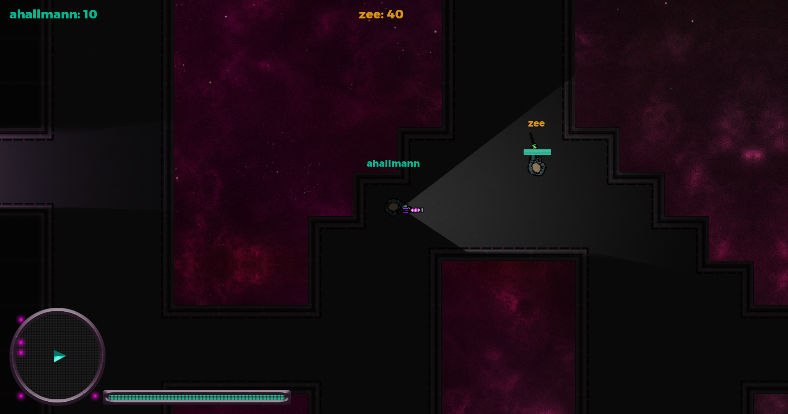

# Spaceship Arena

A multiplayer space shoot-em-up in a desolate space station.
The isolation is getting to you. Everyone is just waiting for their moment to snapand when strange blobs start attacking everyone the rampage starts.

Engine: [Godot](https://godotengine.org/)
Based on the following example: [Multiplayer Bomber Demo](https://godotengine.org/asset-library/asset/139)

## Screenshots

## Controls

- Move with `WASD`, shoot with `Left Mouse Click` or `Space`, change weapons with `1-7` or `mouse wheel`, toggle flashlight with `F` and toggle music with `M`.

## Context

This is our Contribution to the [team neusta gamejam](http://team-neusta-gamejam.de/) 2020.

The themes this year were: 
- *Isolation*
  - done through Atmosphere, planned to have Rooms with Airlocks 
- *Alternative Physics*
  - done through Weapon Design, more Powerups and wacky Weapons planned
- *Time Travel*
  - done through Backstory, planned to have Powerups which take us back in time

